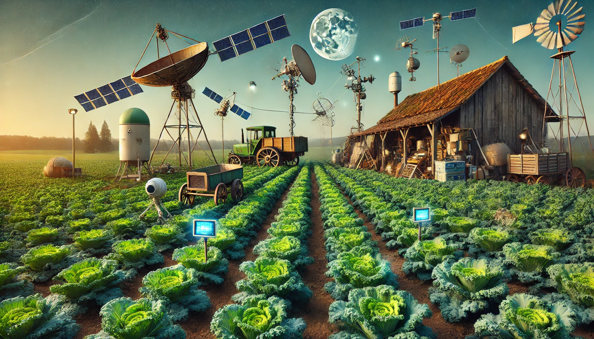

# The KALEpail Project



<!-- TODO this needs updating to reflect the updates -->

## A Proof-of-<i>Team</i>work Stellar Asset

> [!CAUTION]
> This contract has not been audited nor has it been fully tested yet, take this into consideration.

`KALE` is a Stellar asset that can only be created by mining it through this contract. Only one unit (`1_0000000`) of the asset can be farmed every minute.

Network | `TESTNET` | `MAINNET`
--- | --- | --- 
Contract | `CDBG4XY2T5RRPH7HKGZIWMR2MFPLC6RJ453ITXQGNQXG6LNVL4375MRJ` | `CDL74RF5BLYR2YBLCCI7F5FB6TPSCLKEJUBSD2RSVWZ4YHF3VMFAIGWA` 
Asset | `KALE` | `KALE`
Issuer | `GDLN4SLKCSXKBPABPSAH2TOQVCCU6LJAMFMGA6NNMDR6HMB5DQZEFCZH` | `GBDVX4VELCDSQ54KQJYTNHXAHFLBCA77ZY2USQBM4CSHTTV7DME7KALE`
SAC | `CDQKZ76ZS7LYDOZ2E7OG5LUJEWDDUNYBVYRJTBJK6645DZBNJWA7DXCR` | `CB23WRDQWGSP6YPMY4UV5C4OW5CBTXKYN3XEATG7KJEZCXMJBYEHOUOV`

## Some Unique Characteristics 
* This is not a winner takes all mining contract. The block reward is distributed to all working farmers based off contributions both to a staking step and a working step.
* The block reward amount will vary up from a `BLOCK_REWARD` base to include any unclaimed `KALE` staked by farmers who were unable to to call `work` for the block.
* The block reward is calculated by the minute but blocks close every `BLOCK_INTERVAL` seconds. This likely will be greater than a minute to ensure an appropriate balance between blockchain load and hash difficulty distribution. Close too quickly and the blockchain could be overwhelmed with requests. Close too slowly and the hash difficulty could be too high for the average CPU miner to participate.
* Block rewards must be claimed passively after the next block has its first `plant` invocation.
* All storage other than a few protocol items is temporary. This keeps things cheap af but also introduces an interesting "risk" mechanic in that if you're tardy to claim your rewards you might just miss out entirely. Don't let those veggies rot!

## The Mining Process

In order to successfully farm `KALE` into your account you must invoke 3 contract functions:
1. Start with the `plant` staking function.
2. Next input your proof of work by calling the `work` function.
3. Finally you can harvest your `KALE` by calling the `harvest` function.

Let's look at each of these steps in more detail.

### 1. `plant`
Step one of all bountiful harvests is planting. In our case planting is the staking step. In order to both commit your interest in mining a block and to multiply your bounty you must stake some amount of `KALE`. Please note that a stake of `0` is permitted and is in fact the only way to get started farming in The KALEpail Project.

The amount you stake will be used as a multiplier against the number of prefix zeros you submit in your `hash` during the `work` step. The math breaks down pretty simply as follows:

`ZEROS_EXPONENT.pow(<number of zeros>) * <stake amount>`
or for you JS folks out there `Math.pow(ZEROS_EXPONENT, <number of zeros>) * <stake amount>`.

So for example if your stake was 1 `KALE` (`amount=1_0000000`) and you mined a hash with 7 prefix zeros and the `ZEROS_EXPONENT` was 4 your total contribution to receiving your share of the harvest would be `4.pow(7) * 1_0000000` or `163_840_000_000`.

The aim of this basic mathematical algorithm is to try and strike a balance between staking power and hashing power where neither is too overly preferred against the other. As time progresses I expect we'll need to continue to refine both the stake and hash weights in order to find the appropriate balance of power between OG farmers, power users and new players.

### 2. `work`

Once you've successfully ~~staked your claim~~ planted your garden you can move on to the actual mining step. The goal here is to attempt to generate a valid hash with the maximum number of prefix zeros. The more zeros you can generate the more `KALE` you'll be able to harvest in the end.

Hashes will be verified via the following function:

```rust
fn generate_hash(
    env: &Env,
    index: &u32,
    nonce: &u128,
    entropy: &BytesN<32>,
    farmer: &Address,
) -> BytesN<32> {
    let mut hash_array = [0u8; 84];

    let mut farmer_array = [0u8; 32];
    let farmer_bytes = farmer.to_xdr(env);
    farmer_bytes
        .slice(farmer_bytes.len() - 32..)
        .copy_into_slice(&mut farmer_array);

    hash_array[..4].copy_from_slice(&index.to_be_bytes());
    hash_array[4..4 + 16].copy_from_slice(&nonce.to_be_bytes());
    hash_array[20..20 + 32].copy_from_slice(&entropy.to_array());
    hash_array[52..].copy_from_slice(&farmer_array);

    env.crypto()
        .keccak256(&Bytes::from_array(env, &hash_array))
        .to_bytes()
}
```

A couple things to note:

1. You can get the `index` value from the instance storage `FarmIndex` key.
2. The nonce is a `u128` so 16 bytes long. That's pretty long.
3. Entropy is the `hash` value of the previous block. 
4. We only take the last 32 bytes of the `farmer` address. This allows us to keep the hash generation process as small, compact and cheap as possible while still supporting both G- and C- `farmer` addresses. (G- addresses are 44 bytes while C- addresses are just 40 when breaking them down to their raw XDR)

I've tried to keep the hash as tight and simple as possible to make it easier and faster to build hashing algorithms without having to fiddle with XDR headers.

Note: you can update your `work` submission if you happen to find a hash with more zeros than your previous submission just keep in mind transaction submissions aren't free (the XLM transaction submission fee) so choose your timing wisely. Submit too soon and you might find a larger zero prefix before the block closes. Submit too late and you might miss the block entirely and thus forfeit your stake.

### 3. `harvest`

Once you've put in a solid block's work you can finally harvest your `KALE`. The `harvest` function will calculate your share of the block reward based on your contribution to the block against the total contributions of all other hard working farmers.

The total available reward will be the base `BLOCK_REWARD` + any stake that wasn't reclaimed during a subsequent `work` invocation.

You are always guaranteed to receive back _at least_ as much as you staked assuming you were able to submit a valid hash for the block in the `work` step.

Keep in mind block's are stored as temporary entries so you either need to act fast to claim your rewards or bump the entry's ttl to keep it from being evicted. Once it's gone, it, your rewards, and your stake are all gone with it.

---

## Protips
* Of `plant`, `work` and `harvest` only `plant` calls `require_auth` on the `farmer` argument. This would allow other accounts to call `work` and `harvest` on behalf of the farmer. This could be useful in joint mining pools where a service could create a separate contract or service which could collect on a portion of `KALE` or some other asset in exchange for performing the `work` and `harvest` functions for other farmers.
* Write a harvest contract that can harvest multiple blocks at a time. Temporary ttl lasts 24 hrs atm so there’s quite a bit of headroom to bundle blocks into single super claim transactions.
    * Build a service that harvests other folks blocks for them (for a fee)
    * Build a service that bumps ttl on blocks (for a fee) to ensure there's time to claim rewards.
* [Patched in late November release, 2024] ~~Don't like submitting two transactions for `plant` and `work`? What's keeping you from writing your own contract that submits both in the same transaction? Atm nothing, so go for it!~~

## Get A Free Launchtube Token
Want to submit mainnet transactions for free? Use [Launchtube](https://github.com/stellar/launchtube)! I'll be handing out 100 XLM API tokens to anyone who asks in our [Discord channel](https://discord.com/channels/761985725453303838/1304843790351204403).

## Available Prebuilt Miners
* [C++ miner](https://github.com/FredericRezeau/kale-miner) — [Frederic 경진 Rezeau](https://github.com/FredericRezeau)
* [Rust miner](https://github.com/kalepail/kale-farmer) — [Tyler van der Hoeven](https://github.com/kalepail)

## Join The Discussion
Come chat it up in the [`KALE` forum discussion](https://discord.com/channels/761985725453303838/1304843790351204403) on the Stellar Global Discord server.

---

## Attribution
The KALEpail project wouldn't have been possible without the initial innovation of the [FCM project](https://github.com/Stellar-Corium/FCM-sc) or the subsequent community efforts spearheaded by [Frederic 경진 Rezeau](https://github.com/FredericRezeau/fcm-miner).
